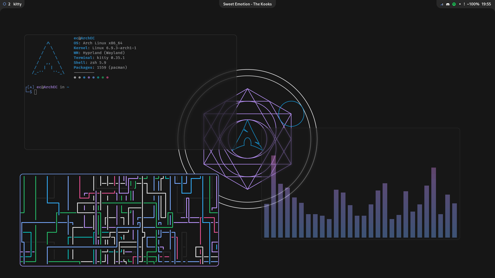

# Cronabot's Dotfiles

This repository contains my personal dotfiles, built on [Hyprland](https://github.com/hyprwm/Hyprland) with heavy use of [ags](https://github.com/Aylur/ags/)

## Screenshots



## Notable Features

- Dynamic background
- Custom status bar
- kitty/neovim workflow
- Cohesive colour scheme

## Installation

### Requirements

- [git](https://git-scm.com/) (source control)
- [Hyprland](https://github.com/hyprwm/Hyprland) (Wayland compositor)
- [ags](https://github.com/Aylur/ags) (bar + widgets)
- [kitty](https://github.com/kovidgoyal/kitty) (terminal)
- [swww](https://github.com/Horus645/swww) (background)
- [zsh](https://www.zsh.org/) (shell)
- [wofi](https://hg.sr.ht/~scoopta/wofi) (application launcher)
- [stow](https://www.gnu.org/software/stow) (dotfiles manager)

#### Optional Programs

- [neovim](https://github.com/neovim/neovim) (text editor)
- [cava](https://github.com/karlstav/cava) (audio visualiser)
- [fastfetch](https://github.com/fastfetch-cli/fastfetch) (system information)
- [cliphist](https://github.com/sentriz/cliphist) (clipboard history tracker)

### Install

First, install all of the [required programs](#Requirements).

Next, clone this repository to your $HOME directory

```
$ git clone https://github.com/Cronabot/dotfiles.git
$ cd dotfiles
```

then use [stow](https://www.gnu.org/software/stow) to create symlinks to your actual home path.

> [!NOTE]
> You may need to remove any files you currently have which may cause conflicts.

```
$ stow *
```

Finally, npm install ags

```
cd ~/.config/ags && npm i
```
